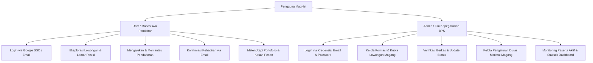
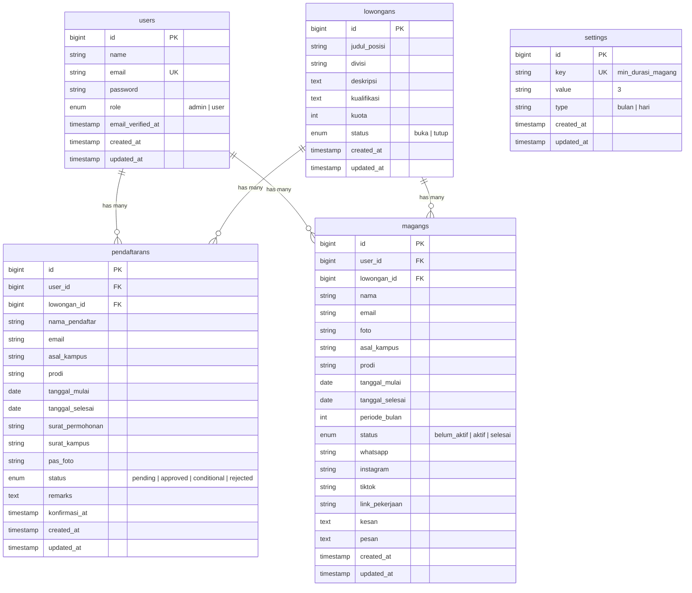

# 📑 Product Requirements Document (PRD)
## MagNet — Sistem Informasi Manajemen & Pendaftaran Magang
**Badan Pusat Statistik (BPS) Kabupaten Bantul**

---

## 1. 📌 Informasi Dokumen
* **Nama Produk:** MagNet (*Magang Network*)
* **Instansi:** Badan Pusat Statistik (BPS) Kabupaten Bantul
* **Versi Dokumen:** 1.1.0
* **Status:** Approved / In Production
* **Stack Teknologi:** Laravel 11.x, PHP 8.2+, MySQL, Tailwind CSS, Alpine.js, Google OAuth 2.0, SMTP Mailer

---

## 2. 🎯 Ringkasan Eksekutif & Latar Belakang

### 2.1. Latar Belakang Masalah
Sebelum adanya sistem MagNet, proses pengajuan magang / Praktik Kerja Lapangan (PKL) di BPS Kabupaten Bantul dilakukan secara semi-manual melalui surat fisik atau kontak tidak terpusat. Hal ini menimbulkan beberapa kendala:
1. Tidak adanya pencatatan kuota dan durasi magang yang transparan dan terstandar per divisi/seksi.
2. Penumpukan berkas surat permohonan dan kesulitan pelacakan status permohonan pendaftar.
3. Ketiadaan basis data terstruktur mengenai riwayat alumni magang, testimoni, dan portofolio hasil kerja peserta magang.

### 2.2. Solusi Produk (MagNet)
**MagNet** adalah platform web terpadu yang mendigitalisasi dan mengotomatisasi seluruh siklus hidup program magang:
* **Katalog Lowongan Magang Per Divisi:** Menampilkan formasi kebutuhan magang (IPDS, Statistik Sosial, Distribusi, Nerwilis, Subbag Umum) beserta sisa kuota dan kualifikasi keahlian.
* **Digitalisasi Pendaftaran:** Pengajuan berkas (Surat Permohonan, Surat Kampus, Pas Foto) secara online dengan validasi durasi dinamis.
* **Otomasi Workflow Kepegawaian:** Verifikasi berkas satu pintu oleh admin dengan aksi *Approved*, *Conditional*, dan *Rejected*.
* **Otomasi Notifikasi Email:** Pengiriman surat pemberitahuan resmi secara otomatis yang dilengkapi tombol konfirmasi kehadiran publik.
* **Direktori Alumni & Portofolio:** Katalog peserta aktif dan alumni magang dengan profil lengkap, media sosial, dan tautan hasil pekerjaan.

---

## 3. 👥 Pengguna & Hak Akses (User Personas)

### Matriks Peran Pengguna:
| Fitur / Modul | Guest / Publik | User (Pendaftar) | Admin (Kepegawaian) |
| :--- | :---: | :---: | :---: |
| Autentikasi Google SSO | ✅ | ✅ | ❌ *(Wajib Kredensial)* |
| Autentikasi Email/Password | ✅ | ✅ | ✅ |
| Konfirmasi Kehadiran (Email Link) | ✅ | ✅ | ✅ |
| Dashboard Ringkasan & Lowongan Tersedia | ❌ | ✅ *(Pribadi & Lowongan)* | ✅ *(Statistik Lengkap)* |
| Katalog & Detail Lowongan Magang | ❌ | ✅ | ✅ |
| Tambah, Edit, Hapus Lowongan Magang | ❌ | ❌ | ✅ |
| Form Pendaftaran Magang (Umum / Spesifik Posisi) | ❌ | ✅ | ✅ |
| Edit & Hapus Pendaftaran (*Pending*) | ❌ | ✅ *(Milik Sendiri)* | ✅ *(Semua)* |
| Review & Update Status Pendaftaran | ❌ | ❌ | ✅ |
| Unduh Berkas Persyaratan | ❌ | ✅ *(Milik Sendiri)* | ✅ *(Semua)* |
| Katalog & Pencarian Data Magang | ❌ | ✅ | ✅ |
| Edit Profil Magang & Portofolio | ❌ | ✅ *(Milik Sendiri)* | ✅ *(Semua)* |
| Pengaturan Sistem (*Durasi Min Magang*) | ❌ | ❌ | ✅ |

---

## 4. 📋 Kebutuhan Fungsional (Functional Requirements)

### 4.1. Modul Autentikasi & Akun Pengguna (FR-AUTH)
* **FR-AUTH-01:** Pengguna dapat masuk menggunakan akun Google (Google OAuth 2.0) atau pasangan Email & Password.
* **FR-AUTH-02:** Pengguna baru yang masuk melalui Google OAuth otomatis dibuatkan akun dengan role `user` dan status email terverifikasi.
* **FR-AUTH-03:** Akun dengan role `admin` dibatasi dan wajib masuk menggunakan Email & Password internal (tidak diizinkan lewat Google SSO demi keamanan akun kepegawaian).
* **FR-AUTH-04:** Sesi login pengguna diamankan dengan masa aktif sesi 15 menit dan *expire on close*.

### 4.2. Modul Lowongan Magang (FR-LOWONGAN)
* **FR-LOWONGAN-01 (Katalog Formasi):** Menampilkan daftar formasi magang yang tersedia di BPS Kabupaten Bantul per divisi/seksi beserta kuota, sisa kursi, deskripsi tugas, dan kualifikasi keahlian.
* **FR-LOWONGAN-02 (Aksi Lamar Posisi):** Pengguna dapat menekan tombol *"Lamar Posisi"* pada kartu lowongan yang otomatis mengarahkan ke form pendaftaran dengan posisi formasi terpilih.
* **FR-LOWONGAN-03 (Manajemen Admin):** Admin dapat menerbitkan lowongan baru, mengedit deskripsi/kuota, mengubah status ketersediaan (`buka`/`tutup`), dan menghapus formasi lowongan.

### 4.3. Modul Pendaftaran Magang (FR-REG)
* **FR-REG-01:** Form pendaftaran mewajibkan isian: Pilihan Posisi Lowongan (opsional/umum), Nama Lengkap, Asal Kampus, Program Studi, Tanggal Mulai, dan Tanggal Selesai.
* **FR-REG-02:** Pendaftar wajib mengunggah berkas:
  * Surat Permohonan Magang (PDF, Maks. 1MB).
  * Surat Pengantar dari Kampus (PDF, Maks. 1MB).
  * Pas Foto Formal (JPEG/PNG/JPG, Maks. 2MB).
* **FR-REG-03 (Dynamic Date Validation):**
  * Tanggal mulai tidak boleh tanggal lampau dan maksimal 7 bulan dari hari ini.
  * Durasi magang (`tanggal_mulai` s.d. `tanggal_selesai`) dihitung otomatis dan divalidasi terhadap ambang batas minimal yang tercatat di tabel `settings` (misal: $\ge 3$ bulan).
* **FR-REG-04:** Pendaftar dapat mengedit kembali formulir dan berkas pendaftaran selama statusnya belum `approved`. Setiap pengeditan otomatis me-reset status menjadi `pending`.
* **FR-REG-05:** Pendaftar dapat menghapus data pendaftarannya selama status masih `pending`.

### 4.4. Modul Verifikasi & Keputusan Admin (FR-ADM)
* **FR-ADM-01:** Admin dapat memfilter daftar pendaftar berdasarkan tahun, bulan, dan kata kunci pencarian (*search*).
* **FR-ADM-02:** Admin dapat meninjau dan mengunduh berkas fisik pendaftar secara langsung.
* **FR-ADM-03 (Status Approval):**
  * **Approved:** Sistem menyalin pas foto ke folder `foto_magang/`, membuat record baru pada tabel `magangs` lengkap dengan `lowongan_id` dengan status `belum_aktif`, mengubah status pendaftaran menjadi `approved`, dan mengirimkan email pemberitahuan penerimaan.
  * **Conditional:** Admin wajib menginput catatan persyaratan perbaikan (`remarks`), sistem mengubah status menjadi `conditional` dan mengirim email berisi instruksi perbaikan dan kontak WhatsApp.
  * **Rejected:** Admin wajib menginput alasan penolakan (`remarks`), sistem mengubah status menjadi `rejected` dan mengirim email pemberitahuan penolakan.
* **FR-ADM-04 (Database Transaction):** Seluruh proses approval dijalankan dalam transaksi database (`DB::beginTransaction()`) untuk menjamin konsistensi data.

### 4.5. Modul Notifikasi Email & Konfirmasi Kehadiran (FR-NOTIF)
* **FR-NOTIF-01:** Email HTML dikirimkan secara otomatis ke alamat email pendaftar saat status diverifikasi oleh admin via SMTP (`PendaftaranStatusMail`).
* **FR-NOTIF-02:** Pada email penerimaan (*Approved*), disediakan tombol tautan publik `/konfirmasi/{pendaftaran_id}`.
* **FR-NOTIF-03:** Halaman konfirmasi mencatat timestamp `konfirmasi_at = now()` dan menampilkan konfirmasi sukses tanpa mewajibkan login ulang.

### 4.6. Modul Direktori Data Magang & Alumni (FR-DIR)
* **FR-DIR-01 (Automated Lifecycle Status):** Status peserta magang dihitung secara dinamis pada Model Eloquent saat penyimpanan data:
  * `belum_aktif`: Hari ini $<$ `tanggal_mulai`
  * `aktif`: `tanggal_mulai` $\le$ Hari ini $\le$ `tanggal_selesai`
  * `selesai`: Hari ini $>$ `tanggal_selesai`
* **FR-DIR-02:** Menampilkan kartu direktori peserta dengan paginasi, pencarian nama, filter asal kampus, dan filter tahun periode.
* **FR-DIR-03:** Peserta magang dapat melengkapi biodata profil berupa kontak WhatsApp (+62), akun sosial media (@Instagram, @TikTok), tautan portofolio, dan testimoni kesan & pesan.
* **FR-DIR-04:** Jika admin menghapus data peserta di menu Magang, berkas foto fisik dihapus dan status pendaftaran terkait otomatis diarsipkan ke status `rejected`.
* **FR-DIR-05 (Kontrol Visibilitas / Hide Data Magang):** Admin memiliki wewenang untuk menyembunyikan (*hide*) atau memunculkan kembali (*unhide*) data peserta magang tertentu dari direktori publik. Data yang disembunyikan hanya dapat diakses dan dikelola oleh Administrator (dilengkapi badge *Hidden* dan filter visibilitas).

### 4.7. Modul Pengaturan Sistem (FR-SET)
* **FR-SET-01:** Admin dapat mengubah nilai parameter `min_durasi_magang` dan satuannya (`bulan` atau `hari`).
* **FR-SET-02:** Perubahan nilai pengaturan langsung berlaku secara real-time pada validasi formulir pendaftaran di frontend dan backend.

### 4.8. Modul Dashboard & Analitik (FR-DASH)
* **FR-DASH-01 (Admin Dashboard):**
  * Ringkasan cepat jumlah lowongan aktif, berkas pending, dan peserta aktif.
  * Statistik agregat pendaftar (*Pending*, *Approved*, *Rejected*, *Conditional*).
  * Grafik tren pendaftaran dan peserta magang per bulan dalam tahun berjalan.
  * **Statistik Asal Kampus:** Visualisasi perbandingan mahasiswa yang sedang aktif magang vs selesai per institusi/kampus dalam bentuk *horizontal grouped bar chart* dan daftar rincian institusi.
  * Kartu pemantauan peserta magang aktif saat ini dengan hitung mundur sisa hari (*remaining days*).
* **FR-DASH-02 (User Dashboard):**
  * Section lowongan magang terbaru yang sedang dibuka di BPS Bantul dengan tombol aksi lamar langsung.
  * Status terkini pendaftaran magang milik pengguna (termasuk badge posisi lowongan yang dilamar).
  * Daftar rekan peserta magang yang sedang aktif bertugas di BPS Bantul.

### 4.9. Modul Asisten Virtual / Chatbot (FR-CHATBOT)

> **Fitur Planned** — Chatbot cerdas berbasis AI (*MagBot*) yang membantu calon peserta magang dan pengguna umum mendapatkan informasi secara cepat dan interaktif tanpa harus menavigasi seluruh halaman aplikasi.

* **FR-CHATBOT-01 (Antarmuka):** Chatbot ditampilkan sebagai *floating widget* di pojok kanan bawah setiap halaman (setelah login), berupa ikon bubble chat berlabel **"MagBot"** yang dapat dibuka/ditutup tanpa meninggalkan halaman.
* **FR-CHATBOT-02 (AI Engine):** Chatbot menggunakan **Google Gemini API** sebagai *language model* utama, dikonfigurasi dengan *system prompt* berisi konteks spesifik:
  * Panduan pendaftaran dan dokumen yang diperlukan.
  * Daftar divisi BPS Kabupaten Bantul beserta kualifikasi dan tugasnya.
  * Penjelasan alur persetujuan (pending → approved / conditional / rejected).
  * Persyaratan durasi minimal magang.
* **FR-CHATBOT-03 (Topik yang Dijawab):** MagBot mampu menjawab pertanyaan seputar:
  * *"Dokumen apa saja yang perlu disiapkan?"*
  * *"Saya dari jurusan IT, divisi mana yang cocok?"*
  * *"Apa maksud status 'conditional'?"*
  * *"Berapa lama minimal durasi magang?"*
  * *"Bagaimana cara konfirmasi kehadiran setelah diterima?"*
* **FR-CHATBOT-04 (Quick Reply):** Tersedia tombol *quick reply* untuk pertanyaan umum paling sering agar pengguna tidak perlu mengetik manual (contoh: "Cara Daftar", "Syarat Dokumen", "Info Divisi", "Status Pendaftaran").
* **FR-CHATBOT-05 (Keamanan API):** Request ke Gemini API dilakukan melalui **Laravel Controller** (backend) sehingga API key tidak pernah terekspos ke sisi browser/client.
* **FR-CHATBOT-06 (Batasan Topik):** Jika pertanyaan di luar konteks magang BPS Bantul, MagBot mengarahkan pengguna dengan sopan untuk menghubungi admin atau mengunjungi halaman yang relevan.
* **FR-CHATBOT-07 (Siklus Riwayat & Reset Percakapan):** Riwayat pesan diikat secara unik pada *User ID* dan *Laravel Session ID* saat ini. Setiap kali pengguna baru login (atau login ulang setelah logout), riwayat chat otomatis direset ke kondisi awal (menampilkan pesan sambutan dan tombol *quick replies*). Pengguna juga dapat mereset percakapan secara manual kapan saja melalui tombol reset (🔄) di header MagBot.

---

## 5. 🔒 Kebutuhan Non-Fungsional (Non-Functional Requirements)

* **Keamanan (Security):**
  * Perlindungan CSRF (*Cross-Site Request Forgery*) pada seluruh formulir mutasi data.
  * Sanitasi input teks menggunakan `strip_tags()` untuk mencegah serangan XSS (*Cross-Site Scripting*).
  * Pembatasan jenis ekstensi file (PDF untuk dokumen, JPEG/PNG untuk foto) dan pembatasan ukuran maksimal file.
  * Enkripsi kata sandi menggunakan algoritma Bcrypt (12 rounds).
* **Integritas & Efisiensi Data (Storage & Performance):**
  * *Garbage Collection:* File fisik lama di storage disk otomatis dihapus ketika pengguna mengunggah file baru atau menghapus data.
  * *Paging & Query Optimization:* Penggunaan `paginate()->withQueryString()` untuk membatasi konsumsi memori pada tabel berskala besar.
* **Arsitektur Kode (Code Cleanliness & Maintainability):**
  * Menerapkan pemisahan validasi request ke dalam class FormRequest (`PendaftaranRequest`, `MagangRequest`, `LowonganRequest`).
  * Penerapan arsitektur MVC bersih (*Lean Controllers*).
* **Kompatibilitas & Tampilan (Usability & Theming):**
  * Antarmuka responsif (*Mobile-first*) menggunakan Tailwind CSS dan Alpine.js.
  * **Dukungan Tema Ganda (Dark Mode & Light Mode):** Pengguna dapat beralih antara Mode Gelap (default) dan Mode Terang kapan saja melalui tombol toggle di sidebar atau header mobile. Preferensi tersimpan di `localStorage` dengan penanganan *zero-FOUC* (bebas kedipan).

---

## 6. 🗄️ Desain Basis Data (Database Schema)

---

## 7. 🛣️ Peta Rute & Titik Akhir API / Web (Route Matrix)

| Metode | URL Path | Nama Rute | Middleware | Deskripsi Fungsi |
| :--- | :--- | :--- | :--- | :--- |
| `GET` | `/` | - | Web | Redirect ke halaman `/login` |
| `GET` | `/login` | `login` | `guest` | Halaman login sistem |
| `POST` | `/login` | - | `guest` | Proses autentikasi kredensial |
| `GET` | `/auth/google/redirect` | `google.redirect` | `guest` | Redirect ke Google OAuth |
| `GET` | `/auth/google/callback` | `google.callback` | `guest` | Callback OAuth dari Google |
| `GET` | `/dashboard` | `dashboard` | `auth, verified` | Dashboard analitik & lowongan tersedia |
| `GET` | `/lowongan` | `lowongan.index` | `auth` | Katalog & pencarian lowongan magang |
| `GET` | `/lowongan/create` | `lowongan.create` | `auth, admin` | Form tambah lowongan baru |
| `POST`| `/lowongan` | `lowongan.store` | `auth, admin` | Simpan lowongan baru |
| `GET` | `/lowongan/{lowongan}` | `lowongan.show` | `auth` | Detail formasi lowongan |
| `GET` | `/lowongan/{lowongan}/edit` | `lowongan.edit` | `auth, admin` | Form edit lowongan |
| `PUT` | `/lowongan/{lowongan}` | `lowongan.update` | `auth, admin` | Update data lowongan |
| `DELETE`| `/lowongan/{lowongan}` | `lowongan.destroy` | `auth, admin` | Hapus data lowongan |
| `GET` | `/konfirmasi/{pendaftaran}` | `daftar.konfirmasi` | Web *(Publik)* | Endpoint konfirmasi kehadiran dari email |
| `GET` | `/pendaftaran-magang` | `daftar.index` | `auth` | Daftar pendaftaran (User / Admin) |
| `GET` | `/pendaftaran-magang/create` | `daftar.create` | `auth` | Form pendaftaran magang baru |
| `POST`| `/pendaftaran-magang` | `daftar.store` | `auth` | Simpan pendaftaran magang baru |
| `GET` | `/pendaftaran-magang/{pendaftaran}` | `daftar.show` | `auth` | Detail pendaftaran & berkas |
| `GET` | `/pendaftaran-magang/{pendaftaran}/edit` | `daftar.edit` | `auth` | Form edit pendaftaran |
| `PUT` | `/pendaftaran-magang/{pendaftaran}` | `daftar.update` | `auth` | Update data & berkas pendaftaran |
| `DELETE` | `/pendaftaran-magang/{pendaftaran}` | `daftar.destroy` | `auth` | Hapus data pendaftaran |
| `POST`| `/pendaftaran-magang/{pendaftaran}/status` | `daftar.updateStatus` | `auth, admin` | Aksi verifikasi status pendaftaran |
| `GET` | `/pendaftaran-magang/{pendaftaran}/download/{field}` | `daftar.downloadFile` | `auth` | Unduh berkas fisik terlampir |
| `GET` | `/magang` | `magang.index` | `auth` | Direktori peserta & alumni magang |
| `GET` | `/magang/create` | `magang.create` | `auth, admin` | Form tambah peserta magang manual |
| `POST`| `/magang` | `magang.store` | `auth, admin` | Simpan data peserta magang manual |
| `GET` | `/magang/{magang}` | `magang.show` | `auth` | Profil detail peserta magang |
| `GET` | `/magang/{magang}/edit` | `magang.edit` | `auth` | Form edit profil & portofolio |
| `PUT` | `/magang/{magang}` | `magang.update` | `auth` | Update profil & portofolio |
| `DELETE` | `/magang/{magang}` | `magang.destroy` | `auth, admin` | Hapus peserta magang & arsipkan pendaftaran |
| `GET` | `/settings` | `settings.index` | `auth, admin` | Halaman pengaturan durasi magang |
| `POST`| `/settings` | `settings.update` | `auth, admin` | Simpan perubahan durasi magang |
| `GET` | `/profile` | `profile.edit` | `auth` | Form edit profil admin |
| `POST`| `/logout` | `logout` | `auth` | Mengakhiri sesi login |
